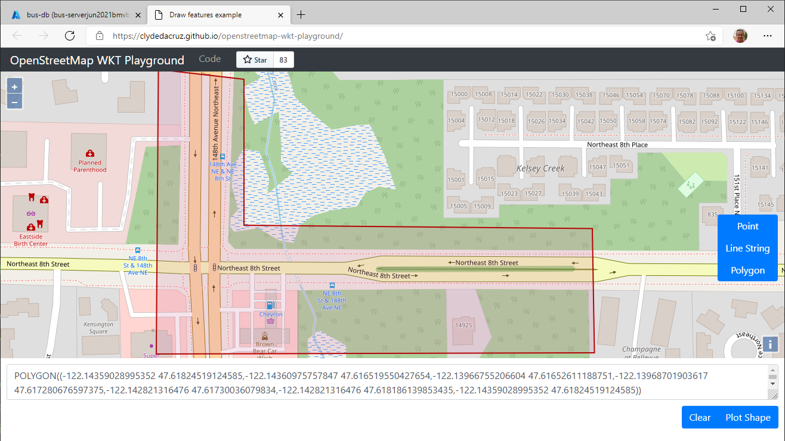
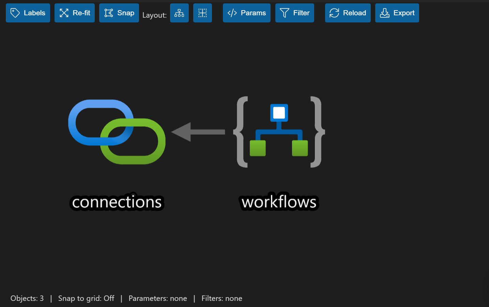
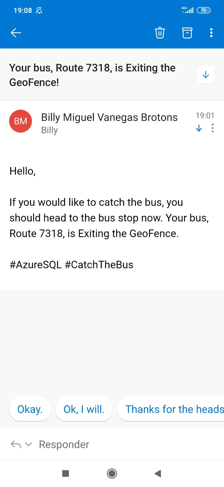

# Practica Final de Az-204 junio 2021


OpenStreetMap WKT Playground

[Draw features example (clydedacruz.github.io)](https://clydedacruz.github.io/openstreetmap-wkt-playground/)

Imagen de la geovalla que se ha dado de alta en Azure para monitorizar que autobuses entran en ella.



### SQLPackage

Instalado con el MSSQL Server Management Studio

En la ruta: 

```
C:\Program Files\Microsoft SQL Server\150\DAC\bin\SqlPackage.exe
```

Desde powershell

```
C:\"Program Files"\"Microsoft SQL Server"\150\DAC\bin\sqlpackage.exe /action:Extract /TargetFile:"bus-db.dacpac"  /SourceConnectionString:"Server=tcp:bus-serverjun2021bmvb.database.windows.net,1433;Initial Catalog=bus-db;Persist Security Info=False;User ID=cloudadmin;Password={password};MultipleActiveResultSets=False;Encrypt=True;TrustServerCertificate=False;Connection Timeout=30;"
```

Connection String

```
Server=tcp:bus-serverjun2021bmvb.database.windows.net,1433;Initial Catalog=bus-db;Persist Security Info=False;User ID=cloudadmin;Password={password};MultipleActiveResultSets=False;Encrypt=True;TrustServerCertificate=False;Connection Timeout=30;
```


[Unidad 7 de 8](https://docs.microsoft.com/es-es/learn/modules/create-foundation-modern-apps/7-exercise-automate-updates)

```
Ejercicio: Automatización de actualizaciones con Acciones de GitHub
```


# Implementando Azure Logic App

La Azure Logic App se desplegará desde un ARM, localizado en ./deployment-scripts/template.json




Ajustar la Logic App con los datos del correo electrónico


Ajustar el correo del destinatario (Todavia no tenemos una pagina web para que el usuario entre su correo)


Enlazamos la Logic App a la Azure Function, copiando la URL donde la logic App esta esperando la llamado por HTTP Post para iniciar su ejecución:


En la Azure Function actualizamos el valor en la variable de entorno **LogicAppUrl**

```
https://prod-15.francecentral.logic.azure.com:443/workflows/747cc7a3b866416b9ab411f09f725eea/triggers/manual/paths/invoke?api-version=2016-10-01&sp=%2Ftriggers%2Fmanual%2Frun&sv=1.0&sig=oCHe5ExVCU8-zpo-XcQUBJipVhhBvPfn9IjrWK37CTo
```


**!Esperamos un rato!**

Y en el monitor de la Azure Function ya aparece un auto bus entrando a la geovalla. ¡Ya podemos salir a la parada y esperarlo! :)


Funcionando nuestra Logic App ya recibimos el correo con la notificación de que debemos salir a la parada.  :)




